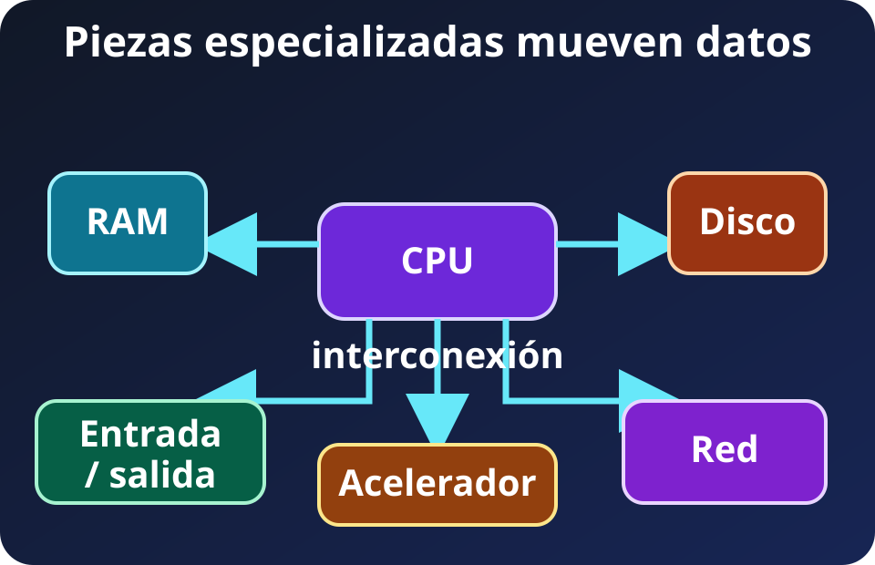
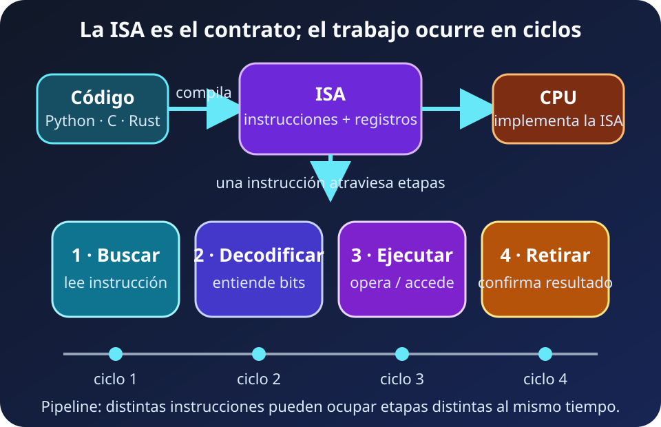

Una CPU no “entiende Python”. Recibe instrucciones binarias, busca sus datos y transforma estado. Entre tu función y esos cambios físicos existe una cadena de contratos.

La idea operativa de partida es sencilla: **compute es transformar datos mediante instrucciones**. La velocidad depende tanto de ejecutar como de tener los datos correctos en el lugar correcto.

## La máquina es un sistema, no un chip



*Diagrama propio del curso, SVG accesible, 2026.*

**Lectura textual del diagrama:** la CPU coordina el flujo principal; RAM conserva el conjunto de trabajo, el almacenamiento persiste información, la red y la entrada/salida comunican el sistema, y un acelerador resuelve operaciones especializadas. Todos intercambian datos mediante interconexiones.

Cada pieza tiene un trabajo distinto:

- **CPU:** ejecuta instrucciones generales y toma decisiones sobre el flujo.
- **RAM:** mantiene instrucciones y datos activos mientras el programa corre.
- **Almacenamiento:** conserva datos aunque la energía se apague.
- **Entrada, salida y red:** conectan la máquina con dispositivos y otras máquinas.
- **Acelerador:** favorece una familia de operaciones, por ejemplo gráficos o multiplicaciones de matrices.

La CPU contiene unidades de control, unidades aritméticas, registros y cachés. No necesitamos memorizar el circuito. Basta reconocer que incluso dentro del chip existen especialistas y movimiento de datos.


**FACT (objeto fotografiado):** MacBook Pro de 14 pulgadas con chip M5. La fotografía muestra un equipo M5; el ejemplo de especificaciones de esta unidad corresponde al M5 Max, no al equipo fotografiado. Foto de [AzureSaturn en Wikimedia Commons](https://commons.wikimedia.org/wiki/File:MacBook_Pro_(14-inch,_M5,_Space_Black).jpg), [CC0 1.0](http://creativecommons.org/publicdomain/zero/1.0/deed.en); convertida a WebP y redimensionada para el curso.

Una laptop parece un solo objeto, pero bajo la carcasa conserva esa topología. En diseños *system on a chip* varias piezas comparten el mismo encapsulado o memoria física; eso acorta rutas, no elimina sus funciones.

## La ISA es el contrato

La **instruction set architecture** o **ISA** define el repertorio visible de instrucciones, registros, formatos y comportamientos que el software puede esperar del procesador. x86-64, ARM y RISC-V son familias de ISA.



*Diagrama propio del curso, SVG accesible, 2026.*

**Lectura textual del diagrama:** C o Rust suelen compilarse hacia instrucciones de una ISA. Python normalmente entrega el programa a un runtime, que a su vez es software compilado para la máquina. La CPU implementa la ISA y procesa instrucciones mediante etapas que se superponen; no existe una regla de una etapa por ciclo.

Una ISA es como el vocabulario y la gramática de una orden. La **microarquitectura** es la organización interna que la cumple. Dos procesadores pueden implementar la misma ISA con pipelines, cachés y unidades distintas, y por eso rendir diferente sin romper el contrato básico.

El contrato no garantiza por sí solo que cualquier binario funcione. También importan la extensión de ISA usada, el sistema operativo, el formato ejecutable y la **ABI**, que acuerda detalles como llamadas a funciones. Un binario x86-64 no se vuelve nativo de RISC-V por estar escrito originalmente en el mismo lenguaje.

Python agrega otra capa. El intérprete o runtime lee bytecode y coordina operaciones; bibliotecas como NumPy pueden delegar el trabajo pesado a código nativo. “Es Python” describe la interfaz del programa, no las instrucciones que finalmente ejecuta la CPU.

## Instrucciones, ciclos y pipeline

Una instrucción puede pedir cargar un dato, sumar, comparar o saltar a otra parte del programa. Como mapa inicial, la CPU **busca**, **decodifica** y **ejecuta**. El resultado puede actualizar un registro, memoria o el siguiente punto del flujo.

El reloj marca oportunidades de coordinación. **DERIVED:** un reloj de 3 GHz tiene un periodo ideal de $1/(3\times10^9)$ segundos, aproximadamente **0.33 ns por tick**. Eso no significa que cada instrucción termine en 0.33 ns ni que el procesador complete exactamente una instrucción por tick.

Un pipeline superpone trabajo: mientras una instrucción se ejecuta, otras pueden estar siendo buscadas o decodificadas. Así aumenta el **throughput**, pero una dependencia, un salto mal predicho o un dato ausente puede introducir esperas.

Por eso “más GHz” no es una comparación suficiente. El trabajo terminado depende de la microarquitectura, las instrucciones por ciclo, el paralelismo disponible y las esperas por datos. La frecuencia sólo describe una parte del presupuesto temporal.

## Cores, threads y SIMD

Un **core** es un motor capaz de avanzar un flujo de instrucciones. Varios cores permiten progresar en varios trabajos a la vez cuando el problema puede separarse.

Un **thread de software** es una secuencia de ejecución planificada por el sistema operativo. Un **thread de hardware** es un contexto de ejecución que el procesador expone al sistema operativo. Cuando un core expone varios threads de hardware, esos contextos comparten buena parte de sus recursos de ejecución. Pueden aprovechar huecos cuando existe trabajo independiente, pero no duplican automáticamente la capacidad del core.

**SIMD** aplica una instrucción vectorial a varios elementos organizados de forma regular. Es ideal para sumar arreglos, filtrar columnas o procesar píxeles. No reemplaza a los cores: explota paralelismo dentro de cada flujo, mientras los cores permiten varios flujos.

Estas capas pueden combinarse:

```text
programa → procesos/threads → cores → instrucciones SIMD → datos
```

La vectorización de NumPy suele ganar por dos razones: evita repetir la coordinación del intérprete para cada elemento y entrega un bloque regular a una biblioteca nativa que puede aprovechar SIMD. El resultado concreto depende de la operación, el tamaño y la memoria; “vectorizado” no significa “siempre paralelo”.

## Latencia y throughput no son sinónimos

**Latencia** es el tiempo para terminar una unidad de trabajo. **Throughput** es cuántas unidades se terminan por intervalo. Un core rápido puede reducir la latencia de una tarea secuencial; más cores pueden elevar el throughput de muchas tareas independientes.

Imagina una cocina. Preparar antes un solo plato reduce su latencia. Servir más platos por hora aumenta el throughput. Agregar cocineros ayuda sólo si hay estaciones, ingredientes y pedidos suficientes; en la computadora, esos límites aparecen como dependencias, memoria y coordinación.

El diagnóstico empieza con la forma del trabajo:

- Flujo secuencial y dependiente: importa la latencia de cada paso.
- Muchas solicitudes independientes: importan cores, threads y throughput.
- La misma operación sobre datos regulares: SIMD puede ser decisivo.
- Unidades ociosas esperando datos: el siguiente tema ya no es compute, sino memoria y movimiento.

El objetivo no es elegir “el mejor CPU” por una cifra. Es identificar qué nivel de paralelismo existe y qué impide usarlo.

## Puente a memoria

Las instrucciones sólo avanzan cuando encuentran sus operandos. Si el dato está cerca, la unidad de ejecución trabaja; si está lejos, espera. La siguiente lección convierte esa distancia en una jerarquía de capacidad, latencia y ancho de banda: [memoria y movimiento de datos](./02_memoria_y_datos.md).

## Fuentes

- [RISC-V International — Ratified Specifications](https://riscv.org/specifications/): definición y especificaciones oficiales de la ISA RISC-V.
- [Intel — Intel® 64 and IA-32 Architectures Software Developer Manuals](https://www.intel.com/content/www/us/en/developer/articles/technical/intel-sdm.html): arquitectura, entorno de programación y referencia oficial de instrucciones x86.
- [Apple Newsroom — MacBook Pro con M5 Pro y M5 Max](https://www.apple.com/newsroom/2026/03/apple-introduces-macbook-pro-with-all-new-m5-pro-and-m5-max/): fuente oficial del ejemplo M5 Max, distinto del M5 fotografiado.
- [Wikimedia Commons — MacBook Pro (14-inch, M5, Space Black)](https://commons.wikimedia.org/wiki/File:MacBook_Pro_(14-inch,_M5,_Space_Black).jpg): fotografía de AzureSaturn, CC0 1.0.
