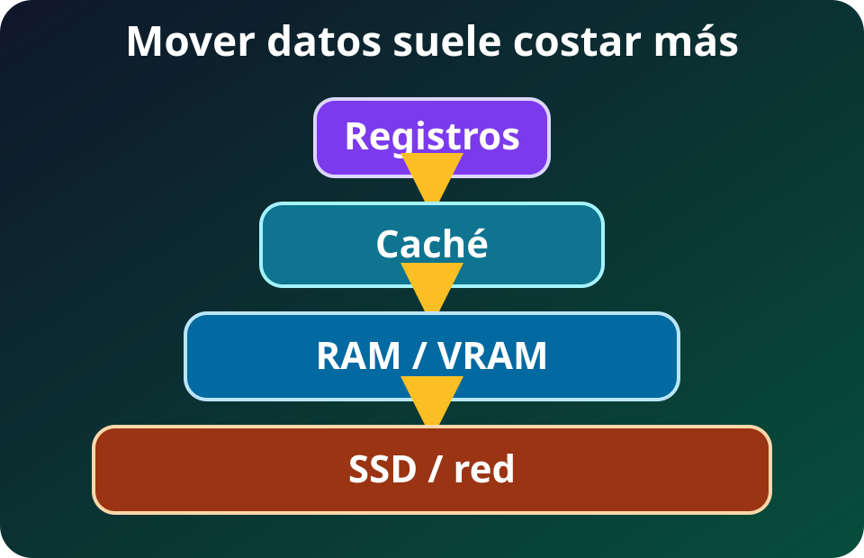

Una unidad de ejecución sólo puede operar sobre datos que ya están a su alcance. Cuando el operando vive lejos, la máquina dedica tiempo, energía y capacidad de interconexión a acercarlo.

La intuición central es esta: **guardar un dato y llevarlo al cómputo son trabajos distintos**. Optimizar uno no garantiza optimizar el otro.

## Una jerarquía, no una bodega

*Diagrama propio del curso, SVG accesible, 2026.*

**Lectura textual del diagrama:** de arriba abajo aparecen registros, cachés, RAM o VRAM y SSD o red. Para calcular, los datos recorren esas capas hacia arriba; resultados y datos desalojados también pueden bajar. Al acercarse al cómputo suele disminuir la capacidad y la latencia, mientras sube el costo por byte. Ninguna capa lejana alimenta instantáneamente a las unidades de ejecución.

Cada nivel resuelve un compromiso:

- **Registros:** operandos y resultados temporales que las unidades de ejecución usan directamente; están dentro del core y tienen capacidad mínima.
- **Cachés:** copias de datos usados recientemente o cercanos; reducen viajes a memoria, pero no caben todos los datos.
- **RAM:** conjunto de trabajo activo del sistema y de los procesos. Es volátil y mucho mayor que las cachés.
- **Almacenamiento local:** SSD u otro medio persistente. Conserva más datos, pero entregarlos tarda más.
- **Almacenamiento remoto:** objetos, archivos o bloques alcanzados por red. Puede crecer mucho, a cambio de más etapas y variabilidad.

“Cerca” describe una ruta física y lógica, no una dirección en el código. Un arreglo puede tener un nombre local y, aun así, provocar lecturas desde RAM, migraciones entre memorias o tráfico de red.

## Capacidad, latencia y ancho de banda

**Capacidad** indica cuánto cabe. **Latencia** mide el tiempo desde pedir un dato hasta poder usarlo. **Ancho de banda** mide cuántos bytes pueden cruzar una ruta por unidad de tiempo.

Una transferencia pequeña y dependiente suele estar dominada por latencia. Un bloque grande y continuo puede amortizar el inicio y acercarse al ancho de banda de la ruta. Por eso una sola lectura aleatoria y un escaneo de columnas no responden a la misma métrica.

La proximidad tampoco es gratuita. Memoria más cercana al cómputo suele ofrecer menos capacidad y mayor costo por byte. El sistema combina niveles para conservar mucho abajo y reutilizar arriba. Los patrones regulares ayudan a traer bloques útiles; los saltos impredecibles desperdician parte de cada bloque y expulsan datos todavía necesarios.

## Dos caminos hacia el cómputo

En una ruta centrada en CPU, el camino conceptual es **SSD o red → RAM → cachés CPU → registros CPU → operación**.

El sistema operativo, el controlador y el dispositivo coordinan la entrada. Después, el hardware de caché acerca automáticamente las líneas que la CPU toca. Una lectura de archivo no deposita normalmente el dato directo en un registro.

Una GPU dedicada agrega memoria y un enlace propios: **SSD o red → RAM → interconexión → VRAM → cachés GPU → registros GPU → operación**.

La **VRAM** es la memoria de trabajo conectada a la GPU. PCIe, NVLink u otra interconexión transporta datos entre dominios según la máquina. Dentro de la GPU también existen registros y cachés; muchas operaciones simultáneas no eliminan esa jerarquía.

**FACT (especificaciones oficiales, no benchmark):** una GeForce RTX 5090 tiene **32 GB de GDDR7** y un ancho de banda de memoria reportado de **1,792 GB/s**. Esas cifras describen capacidad y ruta VRAM↔GPU, no la velocidad SSD↔GPU ni el rendimiento de cualquier programa.

La copia adicional puede dominar un trabajo corto. Agrupar transferencias y mantener resultados intermedios en VRAM suele ser más valioso que acelerar un kernel aislado. La medición debe incluir carga, copia, sincronización y devolución, no sólo el cálculo.

## DMA mueve; la CPU coordina

Con **direct memory access** o **DMA**, un dispositivo transfiere bloques hacia o desde memoria sin que la CPU ejecute una copia por cada byte. La CPU y el driver todavía preparan buffers y direcciones, programan el dispositivo y observan la terminación. DMA reduce trabajo de copia en la CPU; no elimina control, interconexión ni sincronización.

Los buffers también deben ser aptos para el dispositivo. El sistema puede fijar páginas, crear mapeos mediante una IOMMU o usar buffers temporales. Por eso “usa DMA” no determina por sí solo la ruta exacta ni su costo.

## `mmap` cambia la interfaz, no la distancia

`mmap` asocia un archivo con una región del espacio de direcciones virtuales del proceso. El programa accede mediante cargas y escrituras de memoria, y el sistema operativo trae páginas cuando hacen falta, normalmente mediante fallos de página y caché de páginas.

Esto evita administrar manualmente cada llamada `read`, pero no significa que todo el archivo ya esté en RAM. La primera visita a una página todavía puede esperar almacenamiento; la presión de memoria puede expulsarla. `mmap` tampoco crea, por sí solo, una ruta directa del SSD a la GPU.

## Memoria unificada tiene varios significados

En una arquitectura con memoria física compartida, CPU y GPU pueden acceder al mismo conjunto de memoria. En una API de **memoria administrada**, un mismo puntero puede ocultar colocación o migraciones entre memorias físicas distintas. Ambos modelos simplifican programación, pero no son equivalentes.

**FACT (límite oficial del producto):** el Apple M5 Max admite hasta **128 GB de memoria unificada** y hasta **614 GB/s** de ancho de banda. Compartir el conjunto evita una copia obligatoria entre RAM y VRAM separadas para ciertos flujos, pero CPU y GPU conservan cachés y permisos; el software debe respetar sincronización y patrones de acceso.

En CUDA, la memoria administrada puede migrar por páginas o permitir acceso remoto según hardware, sistema operativo y enlace. Un único espacio de direcciones no garantiza que el dato resida junto al procesador que lo usa. Accesos alternados pueden convertir la comodidad en tráfico.

## Rutas directas y sus límites

En Linux, `O_DIRECT` intenta reducir los efectos de la caché de páginas. Tiene restricciones de alineación y soporte por filesystem, puede fallar o degradar a I/O con buffer, y no es universalmente más rápido. Es una opción para casos medidos, no una promesa de acceso instantáneo.

Tecnologías como **GPUDirect Storage** permiten, en configuraciones compatibles, DMA entre almacenamiento local o remoto y memoria GPU sin un *bounce buffer* en RAM de la CPU. Requieren GPU, drivers, filesystem, buffers y topología compatibles; existe una ruta de compatibilidad que vuelve a copiar mediante RAM. La CPU aún ejecuta el camino de control y los bytes aún cruzan dispositivos y enlaces.

El principio operativo permanece: **directo significa menos escalas, no cero movimiento**.

## Diagnosticar antes de comprar

Una carga revela su límite por síntomas distintos:

- Datos que no caben: límite de capacidad en RAM o VRAM.
- Muchas esperas pequeñas: problema probable de latencia o localidad.
- Transferencias largas que saturan una ruta: límite de ancho de banda.
- GPU ociosa durante carga: pipeline de almacenamiento, CPU o interconexión insuficiente.
- Repetición de copias del mismo bloque: colocación y reutilización deficientes.

Primero se mide el camino completo. Después se decide entre reducir bytes, agrupar I/O, mejorar localidad, conservar datos cerca del cómputo o elegir otra capacidad e interconexión. La siguiente lección conecta este movimiento con [paralelismo, performance y energía](./03_paralelismo_performance_energia.md).

## Fuentes

- [Linux Kernel — Dynamic DMA mapping Guide](https://docs.kernel.org/core-api/dma-api-howto.html): direcciones, mapeos e IOMMU en transferencias DMA.
- [Linux man-pages — `mmap(2)`](https://www.man7.org/linux/man-pages/man2/mmap.2.html): semántica oficial del mapeo de archivos y memoria virtual.
- [Linux man-pages — `open(2)` y `O_DIRECT`](https://man7.org/linux/man-pages/man2/open.2.html): efectos de caché, alineación, soporte y cautelas de I/O directo.
- [Apple Developer — `MTLStorageMode.shared`](https://developer.apple.com/documentation/metal/mtlstoragemode/shared): acceso compartido CPU/GPU y obligación de sincronizar.
- [Apple Newsroom — MacBook Pro con M5 Pro y M5 Max](https://www.apple.com/newsroom/2026/03/apple-introduces-macbook-pro-with-all-new-m5-pro-and-m5-max/): capacidad y ancho de banda oficiales del M5 Max.
- [NVIDIA — GeForce RTX 5090](https://www.nvidia.com/en-us/geforce/graphics-cards/50-series/rtx-5090/): capacidad GDDR7 y ancho de banda oficiales.
- [NVIDIA — CUDA Programming Guide, Unified and System Memory](https://docs.nvidia.com/cuda/cuda-programming-guide/02-basics/understanding-memory.html): colocación, migración y variaciones de memoria administrada.
- [NVIDIA — GPUDirect Storage Overview Guide](https://docs.nvidia.com/gpudirect-storage/overview-guide/): ruta directa, DMA, requisitos y fallback mediante memoria CPU.
