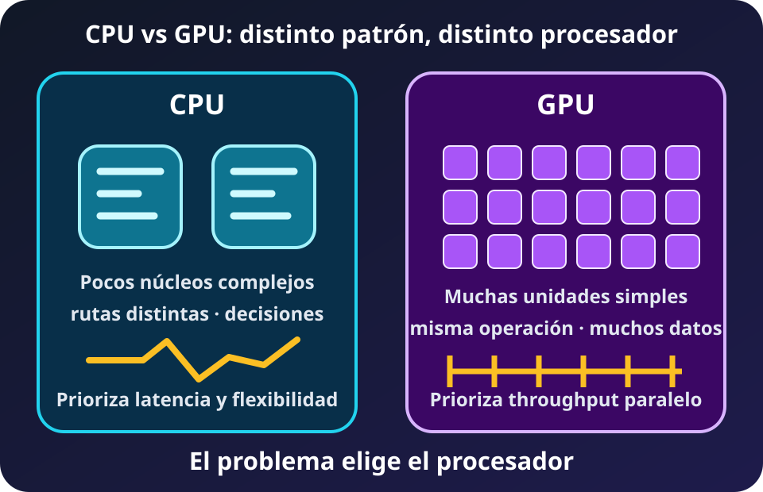
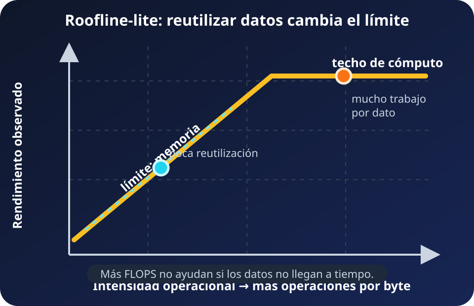
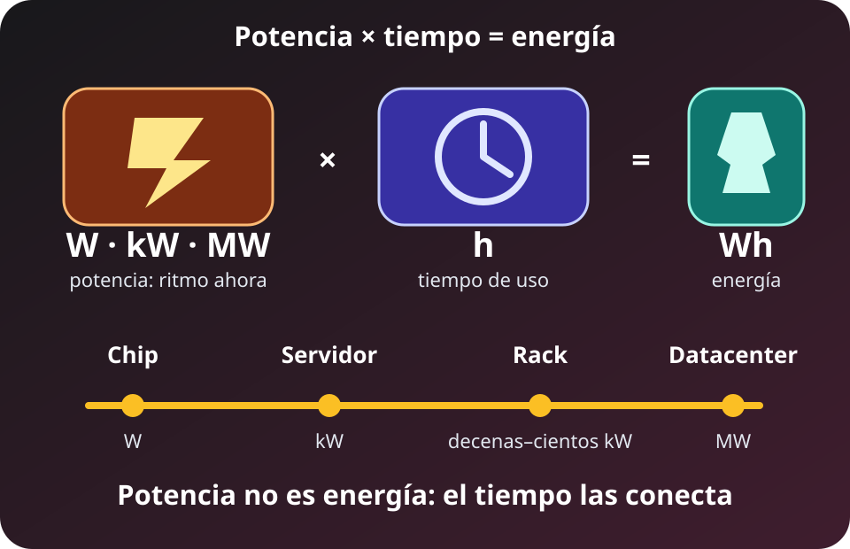

CPU, GPU y aceleradores transforman datos, pero organizan el paralelismo de maneras distintas. **El mejor procesador coincide con la forma del trabajo y el recurso que lo limita**. El pico anunciado es un techo condicionado, no el resultado de una aplicación.

## CPU y GPU intercambian flexibilidad por amplitud

*Diagrama propio del curso, SVG accesible, 2026.*

**Lectura textual del diagrama:** la CPU dedica más recursos a pocos flujos con decisiones y baja latencia. La GPU reúne muchas unidades para aplicar operaciones parecidas a numerosos datos. Ninguna forma sirve para todo problema.

Una CPU suele resolver bien control irregular, lógica secuencial, preparación de datos y solicitudes pequeñas. Sus cores buscan avanzar cada flujo con rapidez. Una GPU favorece **throughput**: necesita suficiente trabajo independiente para mantener ocupadas muchas unidades.

La GPU ejecuta threads en grupos. Cuando divergen sus ramas o accesos, parte de la máquina espera. Lanzar kernels, sincronizar y copiar datos también cuesta. Un kernel rápido puede perder el beneficio dentro del flujo completo.

CPU y GPU suelen cooperar. La CPU prepara y coordina; la GPU procesa lotes regulares; después ambas sincronizan resultados. El límite puede estar en cualquiera de esas etapas.

**FACT (objeto y especificación):** la fotografía muestra una Palit GeForce RTX 5090 GameRock. NVIDIA especifica para la RTX 5090 **575 W de TGP**, una referencia de potencia de la tarjeta, no una medición del equipo completo. Foto de [PantheraLeo1359531 en Wikimedia Commons](https://commons.wikimedia.org/wiki/File:Palit_GeForce_RTX_5090_Gamerock_20250530_HOF3973-HDR_RAW-Export.png), [CC BY 4.0](https://creativecommons.org/licenses/by/4.0); redimensionada y convertida a WebP para el curso.

## NPU y TPU reducen la generalidad

Un acelerador reserva hardware y memoria para un dominio. Una **NPU** suele ejecutar operadores neuronales definidos por el fabricante, a menudo dentro de un teléfono o laptop. Favorece inferencia local eficiente, pero un operador no soportado puede regresar a CPU o GPU.

Una **TPU** es un ASIC orientado a operaciones tensoriales y a un ecosistema de software concreto. No es simplemente una GPU con otro nombre. **FACT (pico oficial, no benchmark):** Google publica para cada chip TPU7x Ironwood **2,307 TFLOPS BF16** y **4,614 TFLOPS FP8**, además de **192 GiB de HBM** y **7,380 GB/s** de ancho de banda HBM. Cambiar precisión cambia tanto la tasa máxima como la memoria y el comportamiento numérico; esos picos no forman un ranking directo contra cifras de otra precisión o sistema.

Especializar puede elevar operaciones por watt, pero reduce flexibilidad. También importan operadores soportados, compilador, memoria, lote, transferencias y disponibilidad.

## FLOP es trabajo; FLOPS es tasa

Un **FLOP** es una operación de punto flotante. **FLOPS** significa operaciones de punto flotante por segundo. GFLOPS, TFLOPS y PFLOPS multiplican esa tasa por $10^9$, $10^{12}$ y $10^{15}$. Un total de FLOP describe trabajo; FLOPS describe ritmo.

La precisión es parte de la unidad de comparación:

- **FP64** conserva más precisión para ciertos cálculos científicos.
- **FP32** ofrece precisión y soporte general.
- **FP16 y BF16** reducen bytes y aprovechan unidades matriciales.
- **FP8 e INT8** reducen más tráfico, con técnicas numéricas apropiadas.

Menos bits no garantiza igual calidad. También deben conservarse los calificadores **dense** y **sparse**. Un pico *sparse* supone una estructura de ceros aprovechable por el hardware; no se compara como si fuera el pico *dense* del mismo chip. TOPS enteros y FLOPS flotantes tampoco son intercambiables.

## Roofline conecta cómputo y memoria

*Diagrama propio del curso, SVG accesible, 2026.*

**Lectura textual del diagrama:** el eje horizontal representa operaciones por byte y el vertical, rendimiento. Con poca reutilización manda el ancho de banda; con mucha se alcanza el techo de cómputo. La ejecución real queda debajo de ambos.

La **intensidad aritmética** es trabajo dividido entre tráfico de memoria:

$$I = \frac{\text{FLOP}}{\text{bytes movidos}}$$

El modelo Roofline-lite expresa un límite:

$$P \leq \min(P_{pico},\ B_{memoria}\times I)$$

**DERIVED (modelo simplificado):** sumar dos vectores FP32 para producir un tercero mueve al menos 12 bytes por elemento, dos lecturas y una escritura, y realiza 1 FLOP. Su intensidad es aproximadamente **0.083 FLOP/byte**, sin contar tráfico adicional. Reutilizar bloques de una multiplicación de matrices puede elevar mucho la intensidad.

En la pendiente conviene mover menos bytes, mejorar localidad o ancho de banda. En la meseta conviene usar mejor las unidades, aumentar paralelismo o elegir otra precisión compatible.

Roofline no predice por sí solo una solicitud pequeña. La latencia de acceso, el arranque de kernels, las dependencias, las ramas y la sincronización pueden dejar el resultado observado muy por debajo del techo. Ancho de banda es volumen por tiempo; latencia es espera para una operación. Ambos se miden.

## Pico, benchmark y aplicación son capas distintas

El **pico teórico** combina unidades, operaciones por ciclo y frecuencia. Puede asumir una precisión, instrucciones matriciales, datos *dense* o *sparse* y frecuencia máxima. No incluye necesariamente entrada, copias ni coordinación.

Un benchmark sólo es comparable si conserva modelo o algoritmo, precisión, objetivo de calidad, escenario, tamaño de lote, software y disponibilidad del sistema. MLPerf separa escenarios y valida calidad; sus mediciones de potencia cubren el sistema completo mediante AC en la pared durante el benchmark.

La **aplicación observada** incluye su pipeline. Latencia, throughput, exactitud, memoria y energía o potencia deben compartir contexto.

## Potencia y energía responden cosas distintas

*Diagrama propio del curso, SVG accesible, 2026.*

**Lectura textual del diagrama:** watts por horas producen watt-hora. Un dispositivo suele expresarse en W, un rack en kW, un centro de datos en MW y la generación agregada puede llegar a GW. Al integrar tiempo aparecen Wh, kWh, MWh, GWh o TWh.

El **watt** mide potencia, una tasa instantánea. El **watt-hora** mide energía acumulada. $1\ \mathrm{kW}=10^3\ \mathrm{W}$, $1\ \mathrm{MW}=10^6\ \mathrm{W}$ y $1\ \mathrm{GW}=10^9\ \mathrm{W}$. Mantener 1 kW durante una hora consume 1 kWh.

TGP describe un límite o referencia de una tarjeta. TDP guía diseño térmico y su definición varía entre fabricantes. La potencia **AC en la pared** incluye componentes y pérdidas que TGP o TDP no cubren. Ninguna de las tres debe rotularse como si fuera la otra.

**DERIVED (escenario, no consumo medido):** 575 W sostenidos durante una hora equivalen a **0.575 kWh** para la tarjeta. El host y las pérdidas quedan fuera. La duración transforma una tasa en energía.

## El power wall cambió la estrategia

Durante décadas, reducir transistores permitió elevar frecuencia sin aumentar igual la densidad de potencia. Al fallar ese escalamiento de voltaje, cerca de 2005, calor y potencia limitaron la frecuencia. La respuesta combinó multicore, SIMD, aceleradores y eficiencia.

El **power wall** no detuvo el progreso. Cambió su forma: más transistores no implican que todos puedan activarse al máximo simultáneamente. Software, paralelismo y especialización pasaron a decidir cuánto hardware resulta útil.

**FACT (objeto fotografiado):** nodo de TSUBAME 4.0 con cuatro GPU NVIDIA H100. La foto ilustra un nodo multi-GPU, no un sistema GB300 actual. Foto de [Fukumoto en Wikimedia Commons](https://commons.wikimedia.org/wiki/File:TSUBAME4.0_P5160984.jpg), [CC BY-SA 4.0](https://creativecommons.org/licenses/by-sa/4.0); redimensionada y convertida a WebP para el curso.

## Del dispositivo a la generación

La escala encadena dispositivo en W, servidor y rack en kW, centro de datos en MW y suministro agregado en MW o GW. Cada nivel añade red, almacenamiento, enfriamiento, conversión y redundancia.

**FACT (capacidad máxima, no consumo observado):** NVIDIA documenta que un rack GB300 NVL72 integra 72 GPU y 36 CPU, usa refrigeración líquida y requiere hasta **142 kW**. **DERIVED (escenario de placa):** 142 kW constantes durante 24 horas serían **3.408 MWh**; durante 8,760 horas serían **1.244 GWh**. El cálculo supone carga constante y excluye infraestructura exterior al rack.

En el nivel global se acumula energía, no sólo potencia. **ESTIMATE (escenario base IEA):** el consumo eléctrico de centros de datos alcanzaría alrededor de **945 TWh en 2030**. Es una proyección con incertidumbre, no una lectura de medidor ni una potencia instantánea.

Escalar compute amplifica movimiento, refrigeración y energía. La siguiente lección lleva estas restricciones a [IA, escala y selección de hardware](./04_ai_escala_y_decision.md).

## Fuentes

- [Berkeley Lab — Roofline Performance Model](https://amcr.lbl.gov/departments/computer-science-department/ppan/roofline-performance-model/): intensidad, ancho de banda y techo de cómputo.
- [NVIDIA — RTX Blackwell GPU Architecture](https://images.nvidia.com/aem-dam/Solutions/geforce/blackwell/nvidia-rtx-blackwell-gpu-architecture.pdf): TGP, precisión y calificadores dense/sparse de la RTX 5090.
- [Google Cloud — TPU7x Ironwood](https://docs.cloud.google.com/tpu/docs/tpu7x): picos por precisión y HBM oficiales.
- [MLCommons — MLPerf Inference: Datacenter](https://mlcommons.org/benchmarks/inference-datacenter/): escenarios, calidad y medición AC del sistema completo.
- [BIPM — The International System of Units](https://www.bipm.org/en/publications/si-brochure): watt, prefijos SI y relación entre potencia y energía.
- [Microsoft Research — Dark silicon and the end of multicore scaling](https://www.microsoft.com/en-us/research/publication/dark-silicon-and-the-end-of-multicore-scaling/): escalamiento de Dennard y límite de potencia.
- [NVIDIA — NVL72 AI Factory, System Hardware and Components](https://docs.nvidia.com/enterprise-reference-architectures/nvl72-ai-factory/latest/components.html): composición, refrigeración y potencia máxima del rack GB300 NVL72.
- [IEA — Energy demand from AI](https://www.iea.org/reports/energy-and-ai/energy-demand-from-ai): escenario de electricidad de centros de datos.
- [Wikimedia Commons — Palit GeForce RTX 5090 GameRock](https://commons.wikimedia.org/wiki/File:Palit_GeForce_RTX_5090_Gamerock_20250530_HOF3973-HDR_RAW-Export.png): fotografía de PantheraLeo1359531, CC BY 4.0.
- [Wikimedia Commons — TSUBAME 4.0](https://commons.wikimedia.org/wiki/File:TSUBAME4.0_P5160984.jpg): fotografía de Fukumoto, CC BY-SA 4.0.
