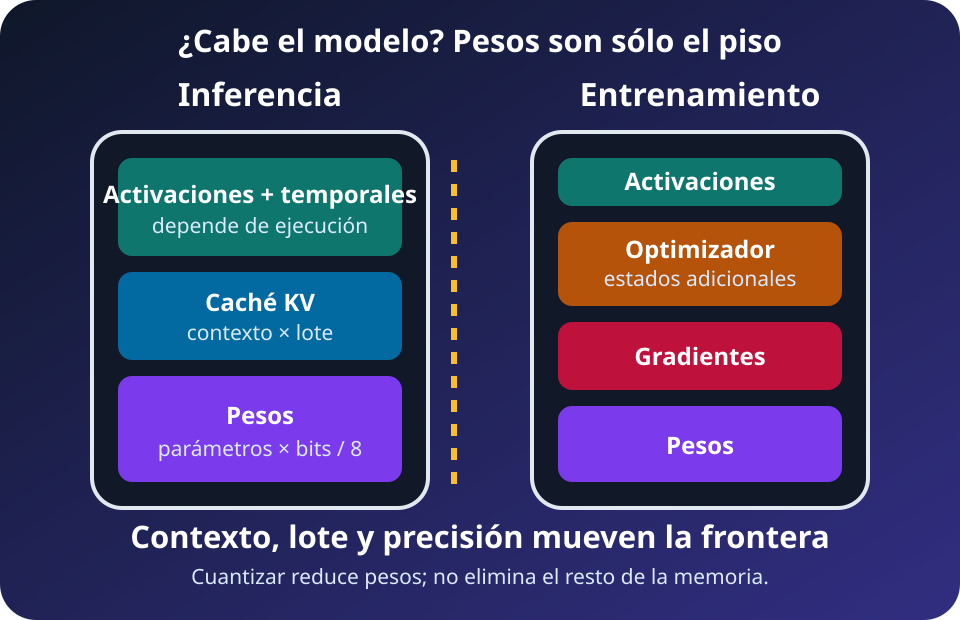
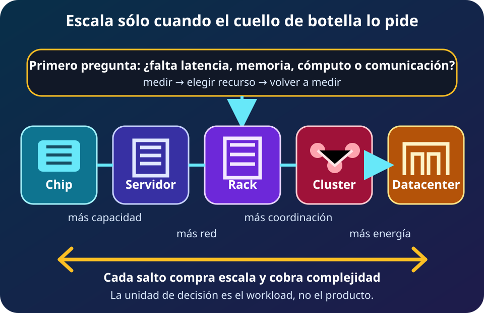
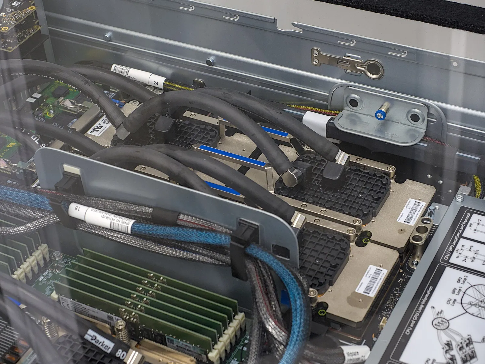
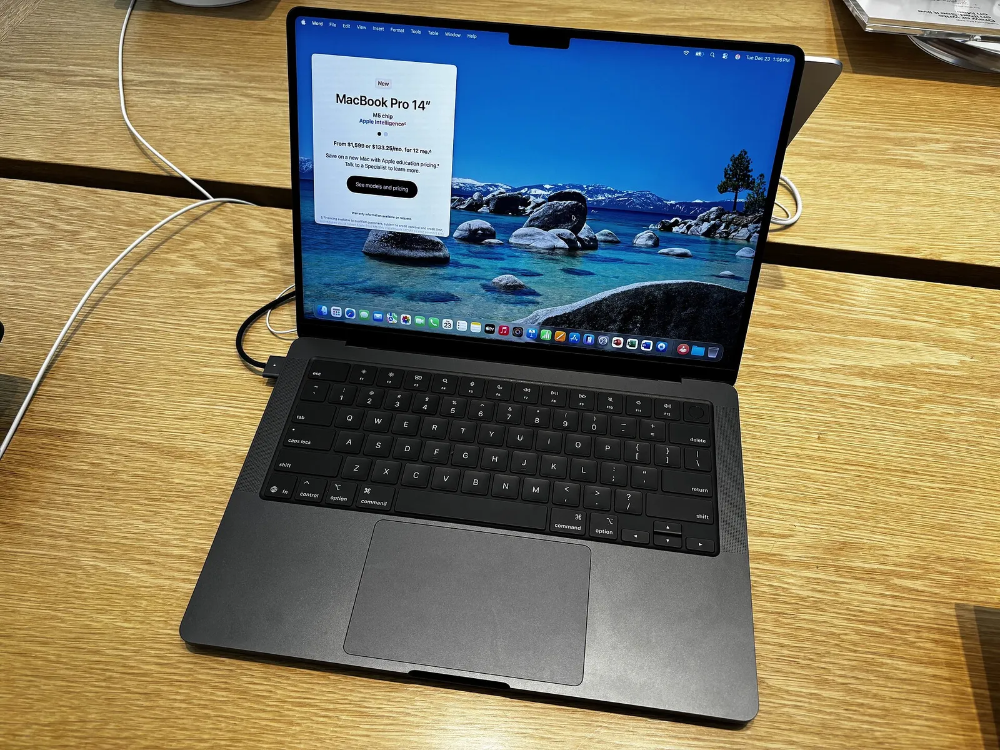

Un modelo de IA transforma entradas con parámetros. El hardware aloja y mueve su estado para cumplir latencia, throughput, energía y costo. **Los parámetros inician el presupuesto, no lo completan.**

## Inferencia y entrenamiento ocupan memoria distinta

*Diagrama propio del curso, SVG accesible, 2026. Los bloques nombran componentes; sus tamaños no están a escala.*

**Lectura textual del diagrama:** inferencia necesita pesos, caché KV y temporales. Entrenamiento añade activaciones, gradientes y estados del optimizador. El runtime reserva otros buffers.

En **inferencia**, el *prefill* procesa el prompt; el *decode* produce tokens sucesivos y reutiliza claves y valores mediante la **caché KV**. Evita recalcular la historia, pero ocupa memoria.

Un **contexto más largo** conserva más tokens: crece la caché KV y aumenta el trabajo de atención. Suele empeorar latencia y throughput por solicitud; el máximo admitido no indica cuántas peticiones caben.

El **batching** procesa varias secuencias juntas. Puede aprovechar mejor el acelerador y elevar throughput agregado, pero consume más memoria y puede sumar espera. Contexto y batch se ajustan por separado con la distribución real de solicitudes.

En **entrenamiento**, forward crea activaciones, backward obtiene gradientes y el optimizador actualiza parámetros. Recomputation intercambia memoria por cálculo; dividir estados, memoria local por comunicación.

## La cuenta mínima de los pesos

Para parámetros almacenados con precisión uniforme, sea $N_p$ su cantidad y $b$ sus bits. B = $10^9$ y T = $10^{12}$.

$$M_{pesos}=N_p\times\frac{b}{8}$$

**DERIVED (GB decimales, sólo pesos):**

- **7B:** BF16 = $7\times10^9\times2$ bytes = **14 GB**; INT8 = **7 GB**; INT4 = **3.5 GB**.
- **70B:** BF16 = **140 GB**; INT8 = **70 GB**; INT4 = **35 GB**.
- **1T:** BF16 = **2 TB**; INT8 = **1 TB**; INT4 = **0.5 TB**.

Son capacidades lógicas. GB decimal y GiB binario difieren; escalas, padding, buffers y particionado agregan overhead.

**DERIVED (piso didáctico):** mixed precision con Adam clásico usa **~18 bytes por parámetro**: 2 de pesos BF16/FP16 + 4 de copia FP32 + 4 de gradiente FP32 + 8 de estados Adam FP32. Para 7B, 70B y 1T son **126 GB**, **1.26 TB** y **18 TB**, antes de activaciones y temporales.

Optimizador, precisión, sharding e implementación cambian ese piso. Activaciones y picos temporales pueden decidir el máximo real.

## Cuantizar cambia más que capacidad

Cuantizar pesos reduce bytes y tráfico, pero introduce escalas y riesgo numérico. INT4 no duplica necesariamente la velocidad de INT8: requiere soporte y puede dominar otro recurso.

Cuantizar pesos no reduce automáticamente caché KV ni activaciones. Valida precisión, contexto, batch y calidad en el hardware real.

## Distribuir crea una segunda carga

Distribuir añade una segunda carga:

- **Paralelismo de datos:** replica el modelo y divide batches. En entrenamiento, **all-reduce** combina gradientes de las réplicas y redistribuye el resultado antes de actualizar; en inferencia, réplicas independientes atienden solicitudes distintas.
- El **paralelismo de modelo** es el paraguas para dividir un modelo entre dispositivos. Sus formas incluyen tensor y pipeline.
- **Paralelismo tensorial:** parte los tensores de cada capa. Operaciones colectivas por capa, como all-reduce o all-gather, intercambian resultados parciales y exigen enlaces rápidos.
- **Paralelismo de pipeline:** coloca grupos consecutivos de capas en dispositivos. Envía activaciones entre etapas y puede crear burbujas de espera.

Bandwidth, latencia y topología determinan el resultado. **Más dispositivos no prometen speedup lineal.**

## Del chip al centro de datos

*Diagrama propio del curso, SVG accesible, 2026.*

**Lectura textual del diagrama:** primero se mide memoria, cómputo y comunicación; después se escala. Cada salto añade capacidad, coordinación, fallas y energía.

La cadena es **chip → board → servidor → rack → cluster → centro de datos**. Cada nivel añade memoria, red, potencia, refrigeración y operación.

**FACT (objeto fotografiado, no ejemplo GB300):** nodo de TSUBAME 4.0 con cuatro GPU NVIDIA H100. Ilustra el nivel servidor multi-GPU; no muestra Blackwell Ultra ni un rack GB300. Foto de [Fukumoto en Wikimedia Commons](https://commons.wikimedia.org/wiki/File:TSUBAME4.0_P5160984.jpg), [CC BY-SA 4.0](https://creativecommons.org/licenses/by-sa/4.0); redimensionada y convertida a WebP para el curso.

## Cuatro ejemplos representativos, no un ranking

**FACT (objeto fotografiado):** MacBook Pro de 14 pulgadas con M5; no es el M5 Max de las especificaciones siguientes. Foto de [AzureSaturn en Wikimedia Commons](https://commons.wikimedia.org/wiki/File:MacBook_Pro_(14-inch,_M5,_Space_Black).jpg), [CC0 1.0](http://creativecommons.org/publicdomain/zero/1.0/deed.en); redimensionada y convertida a WebP para el curso.

- **FACT (límite de producto):** M5 Max admite hasta **128 GB unificados** y **614 GB/s**. Puede evitar copias RAM↔VRAM en ciertos flujos; los máximos no son benchmark ni TDP.
- **FACT (referencia):** RTX 5090 tiene **32 GB GDDR7**, **1,792 GB/s** y **575 W TGP**. Pesos, cachés y temporales comparten capacidad; tarjetas de ensambladores pueden variar.
- **FACT (por chip, picos oficiales):** TPU7x Ironwood ofrece **192 GiB HBM**, **7,380 GB/s**, **2,307 TFLOPS BF16** y **4,614 TFLOPS FP8**; un pod llega a **9,216 chips**. Los picos cambian con precisión y no son desempeño observado.
- **FACT (sistema oficial, máximos agregados):** DGX GB300 integra **72 GPU Blackwell Ultra**, **36 CPU Grace**, **20 TB de memoria GPU**, hasta **576 TB/s** HBM y **130 TB/s NVLink**. El rack usa refrigeración líquida y admite hasta **142 kW**; es capacidad máxima, no consumo medido.

No son un ranking: aplicación, precisión, software y medición de extremo a extremo cambian la decisión.

## Guía de decisión

1. **Define la carga:** inferencia o entrenamiento, precisión, contexto, concurrencia, latencia y volumen.
2. **Presupuesta memoria:** pesos más caché KV o activaciones, gradientes, optimizador, temporales y margen del runtime.
3. **Mide:** utilización, memoria máxima, bytes, latencia, throughput, potencia de pared y calidad.
4. **Ataca el límite:** capacidad para OOM; localidad o bandwidth para datos; compute para unidades saturadas; interconexión para comunicación.
5. **Escala el tramo útil:** batching, cuantización validada y cluster sólo cuando capacidad o servicio lo exige.
6. **Incluye operación:** software, disponibilidad, confiabilidad, seguridad, costo total y energía.

## Repaso conceptual

1. ¿Por qué conocer sólo el tamaño de los pesos no basta para decidir si una inferencia cabe?
2. ¿Cómo cambian contexto y batching la memoria y los objetivos de servicio?
3. ¿Qué omite el piso didáctico de 18 bytes por parámetro?
4. ¿Cuándo cuantizar puede ahorrar memoria sin reducir proporcionalmente la latencia?
5. ¿Por qué el paralelismo de datos y el de modelo generan comunicación distinta?
6. ¿Qué evidencia justificaría pasar de un servidor a un cluster?

## Escenarios de decisión

### Escenario 1 — Asistente local

Un 70B INT4 debe correr sin red. **DERIVED:** sus pesos ocupan 35 GB antes de caché KV y temporales. ¿Elegirías **32 GB FACT** de VRAM, hasta **128 GB FACT** unificados o un modelo menor? Justifica capacidad, contexto y latencia.

### Escenario 2 — API concurrente

El modelo cabe, pero más concurrencia causa OOM y peor tiempo por token. ¿Reducirías contexto o batch, cuantizarías caché, añadirías réplicas o dividirías el modelo? Propón dos mediciones.

### Escenario 3 — Entrenamiento distribuido

Un entrenamiento escala dentro del servidor, no entre racks; las GPU esperan sincronización. ¿Comprarías GPU, cambiarías particionado o mejorarías red? Explica el tráfico actual y cómo confirmarías la intervención.

## Flashcards

- **Pesos:** parámetros aprendidos que usa la inferencia.
- **Caché KV:** claves y valores de atención conservados para no recalcular el contexto previo.
- **Contexto:** tokens de entrada más historial y salida que el servicio debe mantener.
- **Batching:** agrupar trabajo para elevar utilización y throughput, usando más memoria y quizá latencia.
- **Cuantización:** representar tensores con menos bits, con requisitos de kernel y validación numérica.
- **Activaciones:** resultados intermedios guardados para calcular gradientes.
- **Gradiente:** señal de cambio de cada parámetro durante backward.
- **Estado Adam:** momentos que el optimizador conserva además de pesos y gradientes.
- **Paralelismo de datos:** réplicas procesan batches distintos y sincronizan gradientes.
- **Paralelismo de modelo:** parámetros u operaciones se reparten entre dispositivos.
- **All-reduce:** operación colectiva que combina y distribuye valores, por ejemplo gradientes.
- **Regla final:** medir el cuello de botella antes de añadir escala.

## Fuentes

- [Hugging Face Transformers — GPU memory usage](https://huggingface.co/docs/transformers/model_memory_anatomy): pesos mixed precision, gradientes, estados Adam, activaciones y temporales.
- [NVIDIA NIM — Troubleshooting GPU Memory OOM](https://docs.nvidia.com/nim/large-language-models/latest/troubleshooting/memory.html): fórmula de pesos, KV cache, contexto y overhead de inferencia.
- [NVIDIA Megatron Bridge — Parallelisms Guide](https://docs.nvidia.com/nemo/megatron-bridge/latest/parallelisms.html): paralelismo de datos/modelo y comunicación colectiva.
- [Apple Newsroom — MacBook Pro con M5 Pro y M5 Max](https://www.apple.com/newsroom/2026/03/apple-introduces-macbook-pro-with-all-new-m5-pro-and-m5-max/): memoria unificada y bandwidth del M5 Max.
- [NVIDIA — GeForce RTX 5090](https://www.nvidia.com/en-us/geforce/graphics-cards/50-series/rtx-5090/): capacidad y TGP; [arquitectura RTX Blackwell](https://images.nvidia.com/aem-dam/Solutions/geforce/blackwell/nvidia-rtx-blackwell-gpu-architecture.pdf): bandwidth.
- [Google Cloud — TPU7x Ironwood](https://docs.cloud.google.com/tpu/docs/tpu7x): HBM, picos por precisión, interconexión y tamaño de pod.
- [NVIDIA — DGX GB300](https://www.nvidia.com/en-us/data-center/dgx-gb300/): composición, memoria y bandwidth; [NVL72 System Components](https://docs.nvidia.com/enterprise-reference-architectures/nvl72-ai-factory/latest/components.html): NVLink, refrigeración y potencia máxima.
- [Wikimedia Commons — MacBook Pro M5](https://commons.wikimedia.org/wiki/File:MacBook_Pro_(14-inch,_M5,_Space_Black).jpg): AzureSaturn, CC0 1.0; [TSUBAME 4.0](https://commons.wikimedia.org/wiki/File:TSUBAME4.0_P5160984.jpg): Fukumoto, CC BY-SA 4.0.
